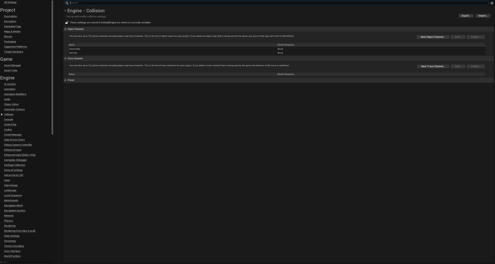

<p align="center">
  
</p>

# Introduction
[Notion Blog(한국어)](https://cuboid-tarantula-e0b.notion.site/Real-Time-Heat-Diffusion-4027725cc9e547aea4269ecee8bc0f40?pvs=4)

# Installation
1. Go to your project folder
2. Create a folder `Plugins` (if not exist)
3. Copy and paste `Heatbox` folder under `Plugins`

# Project Settings



Alternatively you can add this lines of code to `DefaultEngine` under `Config` folder.
```
+DefaultChannelResponses=(Channel=ECC_GameTraceChannel1,DefaultResponse=ECR_Block,bTraceType=False,bStaticObject=False,Name="Flammable")
+DefaultChannelResponses=(Channel=ECC_GameTraceChannel2,DefaultResponse=ECR_Block,bTraceType=False,bStaticObject=False,Name="Burning")
```
***Note that the ordering does matter!***

# Example
You can test the plugin's features with the example map I set up for you and the basic setup can be found on its level blueprint.


Play with `DT_FireSim_BoxInfo`. This data table contains core variables that affect the simulation.


